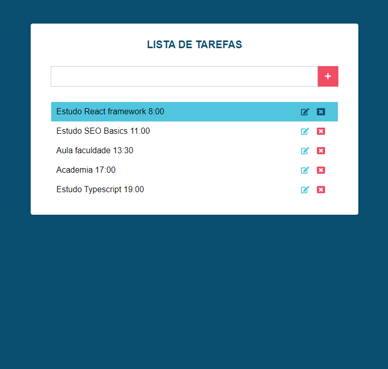

# Lista de Tarefas React

Projeto desenvolvido com o framework React. Tem como objetivo uma implementação básica para conhecer o funcionamento de componentes stateful e stateless por meio de operações CRUD em uma lista de tarefas.

